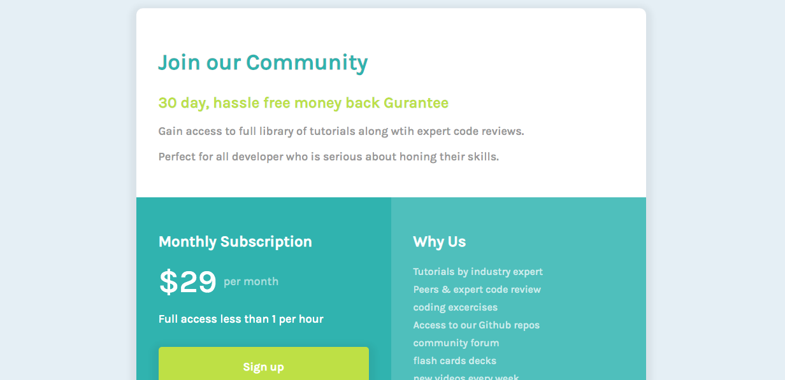

# front-end mentor - Single price grid challenge



## Continued development

so far, I  built the desktop design of the challenge, definately would work all mobile view and responsiveness in the various sizes

## what I learned

```html
 <small>I am proud of this</small>, '&dollar' sign, which was helpful in the project.
 ```css
  I learned how to use the "font-family: tahoma", how to style a "sign up" button and add box shadow,
```

## links

[Live](https://brymmobaggins.github.io/single-price-grid-component-solution/)

## Built with

- semantic HTML5 mark up
- flexbox
- css grid

## Screenshot 

